  

---

## 🔧 Tech Stack

&nbsp;&nbsp;

---

## 🚀 Featured Projects

---

**01 &nbsp; 🤖 [TORCS AI Racing Driver](https://github.com/Quttoshi/TORCS-AI-Racing-Driver)**
> ML-based autonomous agent trained end-to-end in the TORCS simulator

---

**02 &nbsp; 🎙️ [LiveTranscription STT](https://github.com/Quttoshi/LiveTranscription-STT)**
> Real-time speech-to-text pipeline with low-latency streaming from live audio

---

**03 &nbsp; 📊 [Time Series Forecasting](https://github.com/Quttoshi/Time-Series-Forecasting-with-ANN-LSTM)**
> Oil price prediction using ANN & LSTM, benchmarked against classical baselines

---

**04 &nbsp; 🔐 [MedLock](https://github.com/Quttoshi/MedLock)**
> Healthcare security solution using blockchain and AES encryption

---

**05 &nbsp; 🕵️ [Job Scraper](https://github.com/Quttoshi/Job-Scraper)**
> Scrapes AI/ML jobs from Indeed & LinkedIn hourly, filters by location & experience, saves to Google Sheets

---

---

## 📫 Connect with Me

&nbsp;&nbsp;

---

⭐️ *"I wire up systems that think, adapt, and ship."*
